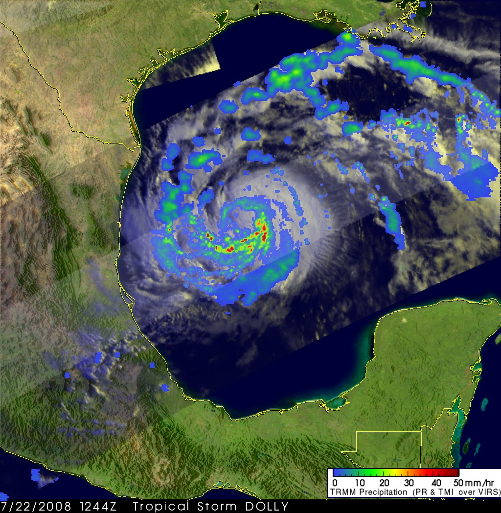

---
title: "Hurricane_Dolly"
author: Ada Yu, Carolyn Wright, Rachel Donahue, Vicky Shan
date: November 19, 2021
output:
  prettydoc::html_pretty:
    theme: cayman
    highlight: github
---

```{r setup, include=FALSE}
knitr::opts_chunk$set(echo = TRUE)
```

```{r, echo = FALSE, include = FALSE,fig.show='hide'}
source("Attempt_615 Hurricane.R", echo = FALSE)
```

```{r, include = FALSE}
library(tidyverse)
library(maps)
library(sp)
library(sf)
library(leaflet)
library(htmlwidgets)
library(drat)
library(hurricaneexposuredata)
library(hurricaneexposure)
data("hurr_tracks")
```

<center>{width=50%}</center>
\pagebreak

# 1. Introduction

We used data from NOAA Data Buoys to analyze and describe the landfall of Hurricane Dolly-2008, which we selected from the Hurricane Exposure package.  

- We provided graphs of rainfall, wind speed, and distance feature of Dolly-2008.

- We used more detailed data available from NOAA buoys to desribe Hurricane Dolly's landfall.


# 2. EDA Exploration  

## 2.1 Task ONE: Graphs of rainfall, wind speed, and distance feature of Dolly-2008

### a. Rainfall Map of Dolly-2008

In this following plot, we observe that when the hurricane makes landfall, the surrounding rainfall level will increase. Also, due to this reason, the rainfall will also increase at the farthest of the land. 

```{r, echo = FALSE,fig.align = 'center'}
ggplot() +
  geom_polygon(Dolly_rain_precip,mapping=aes(x=long, y=lat, group=group, fill=`rainfall`),color = "white") + 
  scale_fill_brewer(palette="Blues")+
  geom_path(data=Dolly_state, aes(x=long, y=lat, group=group), color="black")+
  geom_path(data=Dolly_ht, aes(x=longitude, y=latitude), color="red")+
  ggtitle("Dolly-2008")+
  theme(
    panel.background = element_blank(),
    axis.text = element_blank(),
    axis.ticks = element_blank(),
    axis.title = element_blank(),
    plot.title = element_text(hjust = 0.5,face = "bold")
  )
```

### b. Wind Speed Map of Dolly-2008

In the following plot, we observe that when the hurricane makes landfall, the  maximum modeled gust wind speed in the surrounding counties will increase. In contrast, the wind speed of the farthest of the land doesn't change, which means that it is not influenced by the hurricane. The blue points are the locations of the 14 buoys we selected to look into. From this plot, we cannot conclude any useful wind speed information from the location of buoys. 

```{r, echo = FALSE,fig.align = 'center'}
ggplot() +
  geom_polygon(Dolly_wind_speed,mapping=aes(x=long, y=lat, group=group, fill=`wind_speed`),color = "white") + 
  scale_fill_brewer(palette="Reds")+
  geom_path(data=Dolly_state_wind, aes(x=long, y=lat, group=group), color="black")+
  geom_path(data=Dolly_ht2, aes(x=longitude, y=latitude), color="red")+
  ggtitle("Dolly-2008")+
  theme(
    panel.background = element_blank(),
    axis.text = element_blank(),
    axis.ticks = element_blank(),
    axis.title = element_blank(),
    plot.title = element_text(hjust = 0.5,face = "bold")
  )
```

### c. Distance Map of Dolly-2008

In the following plot, we observe the distance between landfall point and other areas of the country. This is a very useful information when discussing the influence of wind during the duration of Hurricane Dolly. 

```{r, echo = FALSE,fig.align = 'center'}
ggplot() +
  geom_polygon(Dolly_distance,mapping=aes(x=long, y=lat, group=group, fill=`distance`),color = "white") + 
  scale_fill_brewer(palette="Greens")+
  geom_path(data=Dolly_state_distance, aes(x=long, y=lat, group=group), color="black")+
  geom_path(data=Dolly_ht, aes(x=longitude, y=latitude), color="red")+
  ggtitle("Dolly-2008")+
  theme(
    panel.background = element_blank(),
    axis.text = element_blank(),
    axis.ticks = element_blank(),
    axis.title = element_blank(),
    plot.title = element_text(hjust = 0.5,face = "bold")
  )
```

## 2.2 Task TWO

### a. Wind Speed Map of Dolly - 2008 with Buoys

```{r, echo = FALSE, include = FALSE,fig.show='hide'}
source("Buoy_Plots.R",echo = FALSE)
```

The following plot shows a map of Hurricane Dolly's maximum modeled gust wind speed by county during the storm. We have plotted the Buoys over this map with their size differing by average windspeed. The larger the size the higher the average windfall for that buoy during the time of Hurricane Dolly. Note: The buoy windspeed measurements were converted from m/s to knots in order to match the scale of the Hurricane Tracks data.

```{r, echo = FALSE, warning=FALSE, comment = FALSE,fig.align = 'center'}
ggplot() +
  geom_polygon(Dolly_wind_speed,mapping=aes(x=long, y=lat, group=group, fill=`wind_speed`),color = "white") + 
  scale_fill_brewer(palette="Reds")+
  geom_path(data=Dolly_state_wind, aes(x=long, y=lat, group=group), color="black")+
  geom_path(data=Dolly_ht2, aes(x=longitude, y=latitude), color="red")+
  geom_point(data = BUOYS_6HOUR_SNAPSHOT, aes(x = long2,y = lat), color = "blue", shape = 10, size = 2)+
  ggtitle("Dolly-2008")+
  theme(
    panel.background = element_blank(),
    axis.text = element_blank(),
    axis.ticks = element_blank(),
    axis.title = element_blank(),
    plot.title = element_text(hjust = 0.5,face = "bold")
  )


```

### b. Comparison of Wind Speed Map Recorded by Hurr_Tracks and the Buoys

The following plot compares the Wind Speed recorded in the hurr_tracks data with the buoy wind measurements over time. Based on the below plot it appears that the buoys are measuring a much lower windspeed overall, however are following a similar pattern

```{r, echo = FALSE, warning=FALSE, comment = FALSE,fig.align = 'center'}
Dolly_Buoy2 <- inner_join(Dolly_ht2, BUOYS_6HOUR_SNAPSHOT, by =  "date")
Dolly_Buoy2$BUOY_ID_F <- ifelse(Dolly_Buoy2$BUOY_ID == "rsjt2",2,
                                ifelse(Dolly_Buoy2$BUOY_ID == "babt2",3,
                                       ifelse(Dolly_Buoy2$BUOY_ID == "mqtt2",4,
                                              ifelse(Dolly_Buoy2$BUOY_ID == "pcnt2",5,
                                                     ifelse(Dolly_Buoy2$BUOY_ID == "ptit2",6,
                                                            ifelse(Dolly_Buoy2$BUOY_ID == "sdrt2",4,Dolly_Buoy2$BUOY_ID))))))


ggplot(data = Dolly_Buoy2) + geom_point(mapping=aes(x=date, y = wind), color = "red") +
  geom_point(mapping= aes(date, y = WSPD_adjusted), color =Dolly_Buoy2$BUOY_ID_F, shape= 10, size = 3) +
  theme(axis.text.x = element_text(angle = 45, hjust = 1),legend.position = "top") + 
  ylab("Wind Speed") + xlab("Date")  + 
  labs(title = "Comparing Wind Speeds From Buoys and Hurr Tracks", subtitle= "Red = Hurr Tracks")

```

### c. Variogram of wind level and rain 

```{r, echo = FALSE, include = FALSE,fig.show='hide'}
source("variogram.R",echo = FALSE)
```

This is a semivariogram that shows that generally as distance between points in the Hurr tracks dataset increases, the difference in their maximum sustained wind speed also increases, indicating a possible spatial relationship. Extrapolating from this plot further is difficult because the data violates the stationarity assumption required for kriging, which states that different regions contained in the data cannot have their outcome values changing at different rates than others, and a hurricane that moves around a region means that change is occurring at different rates depending on where it is at a given moment. 

```{r, echo = FALSE, warning=FALSE, comment = FALSE,fig.align = 'center'}
plot(v, emp, main="Semivariogram of 1 min Max Wind Speed (Hurr_Tracks Data)", pch=20,color="red")
```

This semivariogram does not have a traditional pattern like in the first example, the observed nugget value is high, indicating that there is a lot of noise in the data, and we can not say if there is a possible spatial relationship between buoy distance and average weed speed. 

```{r,echo = FALSE, warning=FALSE, comment = FALSE,fig.align = 'center'}
plot(v2, emp2, main="Semivariogram of Average Wind Speed (Buoy Data)", pch=20,color="blue")

```

This is a semivariogram that shows that generally as distance between points in the Hurr tracks dataset increases, the difference in their maximum sustained rainfall also increases, indicating a possible spatial relationship. This is no related rainfall information in Buoys information. 

```{r,echo = FALSE, warning=FALSE, comment = FALSE,fig.align = 'center'}
plot(v_rain, emp_rain, main="Semivariogram of daily rainfall given 5 days before and 3 days after ", pch=20,color="red")

```

# Reference

https://www.ndbc.noaa.gov/

https://www.nasa.gov/mission_pages/hurricanes/archives/2008/h2008_dolly.html

# Conclusion